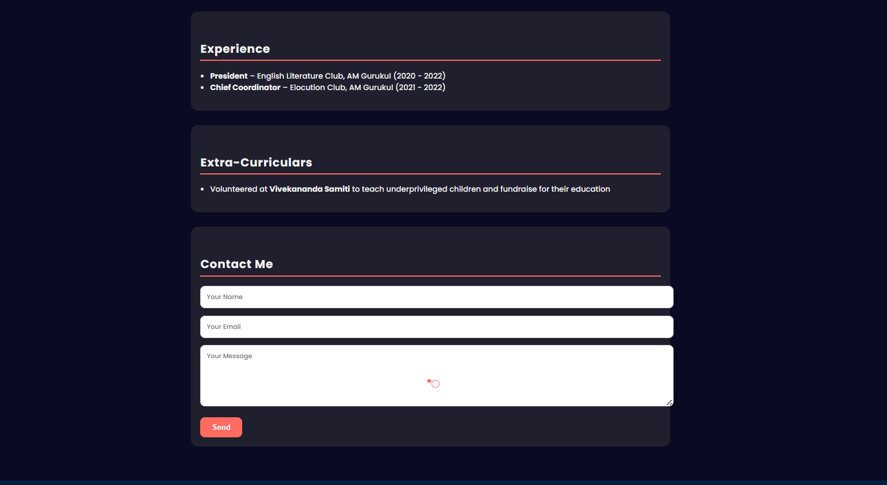

# Prasad Kale — Portfolio Website

Personal portfolio website for **Prasad Kale**, ECE Student | Embedded Developer | Quizzing Enthusiast.

## Website Preview

### Home Section


### Projects Section


🔗 **Live site:** https://prasad995.github.io/Website/

📍 Nashik, Maharashtra
## Sections

- **Education** — B.Tech in Electronics and Communication Engineering (MIT WPU, Pune), and academic history
- **Skills** — Programming (C, C++, Embedded C, Assembly), Tools (Git, GitHub, VS Code, Multisim, Keil/uVision), Hardware (Arduino, 8051 Microcontroller), Soft Skills
- **Projects** — Featured embedded systems projects (see below)
- **Experience** — Leadership roles including President of the English Literature Club and Chief Coordinator of the Elocution Club
- **Activities** — Volunteering with Vivekananda Samiti, teaching underprivileged children and fundraising for their education
- **Contact** — Contact form for getting in touch

## Featured Projects

| Ultrasonic Radar System | RFID-Based Attendance System |
|---|---|
|  |  |
| Arduino radar visualization system | RFID-based attendance logging system |

## Repository Structure

```
Website/
├── index.html             # Main site page
├── resume.docx             # Downloadable resume
├── RFID.jpg                 # RFID project image
├── ultrasonic radar.jpg     # Ultrasonic radar project image
└── README.md
```

## Built With

- HTML

## Deployment

This site is deployed using [GitHub Pages](https://pages.github.com/), served directly from the `main` branch.
